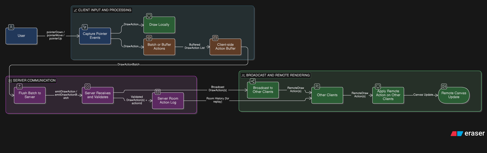
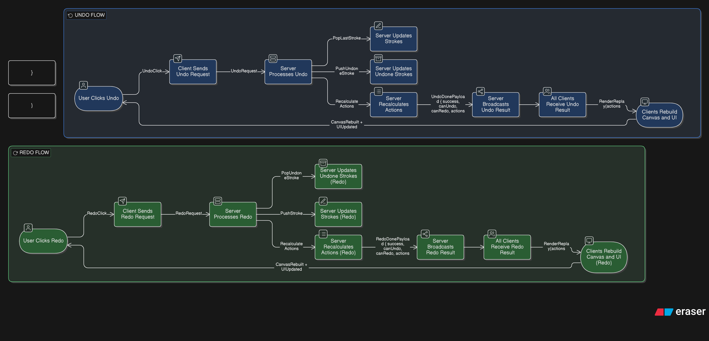

# CoCanvas Architecture Documentation

## 📊 System Overview

CoCanvas is a real-time collaborative drawing application built with React (TypeScript) on the frontend and Node.js with Socket.IO on the backend. The system enables multiple users to draw simultaneously on a shared canvas with real-time synchronization, global undo/redo, and live cursor tracking.

## 🔄 Data Flow Diagrams

### **1. Drawing Event Flow**



### **2. Undo/Redo Flow**



## 🔌 WebSocket Protocol

### **Client → Server Events**

| Event                     | Payload                                        | Purpose                 |
| ------------------------- | ---------------------------------------------- | ----------------------- |
| `draw-action`             | `{ type, toolType, point, config, timestamp }` | Single drawing action   |
| `draw-action-batch`       | `{ actions[], batchId }`                       | Batched drawing actions |
| `cursor-move`             | `{ point, timestamp }`                         | User cursor position    |
| `user-data`               | `{ id, userName }`                             | User identification     |
| `undo` / `redo` / `reset` | (empty)                                        | Canvas operations       |

### **Server → Client Events**

| Event                               | Payload                                    | Purpose                       |
| ----------------------------------- | ------------------------------------------ | ----------------------------- |
| `init`                              | `{ userId, roomId, color }`                | Initial connection setup      |
| `canvas-state`                      | `{ actions[], canUndo, canRedo }`          | Full canvas state on connect  |
| `draw-action` / `draw-action-batch` | `{ ...action, userId, actionId }`          | Broadcast drawing actions     |
| `cursor-move`                       | `{ userId, point, timestamp }`             | Other users' cursor positions |
| `undo-done` / `redo-done`           | `{ success, actions[], canUndo, canRedo }` | State after undo/redo         |
| `users-update`                      | `[{ userId, userName, color }]`            | Active users list             |

### **Message Flow Example**

```typescript
// User draws a stroke
Client A: draw-action { type: "start", point: {x,y}, ... }
  → Server: Adds actionId, broadcasts to room
  → Client B: Receives draw-action, applies to canvas

// Batched drawing
Client A: Accumulates 10 "draw" actions locally
  → Sends draw-action-batch after 50ms
  → Server: Broadcasts entire batch
  → Clients: Apply all actions efficiently
```

## 🧠 Undo/Redo Strategy

### **Stroke-Based Architecture**

**Key Decision**: Group `start → draw[] → end` as one logical stroke

```javascript
// Stroke structure
{
  userId: "abc123",
  actions: [
    { type: "start", point: {x:10, y:20}, ... },
    { type: "draw", point: {x:11, y:21}, ... },
    { type: "draw", point: {x:12, y:22}, ... },
    { type: "end", point: {x:13, y:23}, ... }
  ],
  startTime: 1234567890
}
```

### **State Management**

```javascript
class DrawingState {
  actions: []          // Flat array for replay (all actions)
  strokes: []          // Completed strokes (for undo)
  undoneStrokes: []    // Undone strokes (for redo)
  currentStroke: null  // In-progress stroke
}
```

### **Undo Process**

1. **Pop last stroke** from `strokes[]`
2. **Push to** `undoneStrokes[]`
3. **Remove stroke's actions** from `actions[]` (by actionId)
4. **Broadcast** new `actions[]` to all clients
5. **Clients clear canvas** and replay all remaining actions

### **Incomplete Stroke Handling**

```javascript
// On disconnect, finalize any in-progress stroke
socket.on("disconnect", () => {
  room.drawingState.finalizeIncompleteStroke();
  // Prevents orphaned start/draw actions
});
```

## ⚡ Performance Optimizations

### **1. Action Batching**

**Problem**: Pointer events fire 60-120 times/second  
**Solution**: Batch multiple "draw" actions before sending

```typescript
// Config
BATCH_INTERVAL_MS: 50    // Send every 50ms
BATCH_MAX_SIZE: 10       // Or when buffer reaches 10

// Logic
pendingActions.push(action);
if (action.type === "start" || action.type === "end") {
  flushBatch(); // Immediate flush for stroke boundaries
} else if (pendingActions.length >= 10 || timeSince >= 50ms) {
  flushBatch(); // Flush on size/time limit
}
```

**Impact**: Reduces messages by ~85% (120/sec → 20/sec)

### **2. Cursor Throttling**

**Problem**: Cursor updates on every pointer move (60+ times/second)  
**Solution**: Throttle to ~60 FPS (16ms intervals)

```typescript
CURSOR_THROTTLE_MS: 16; // ~60 FPS
CURSOR_TIMEOUT_MS: 2000; // Hide inactive cursors

// Throttle logic
const now = Date.now();
if (now - lastEmission >= 16) {
  emitCursorMove(point);
  lastEmission = now;
} else {
  scheduleNextEmission(16 - timeSince);
}
```

**Impact**: Reduces cursor messages by ~75%

### **3. Canvas Replay Strategy**

**For Undo/Redo**: Full canvas redraw

```typescript
// Clear and replay all actions
ctx.clearRect(0, 0, canvas.width, canvas.height);
actions.forEach((action) => applyRemoteAction(action));
```

| Strategy                  | Pros                           | Cons                            |
| ------------------------- | ------------------------------ | ------------------------------- |
| **Full redraw (current)** | Simple, guaranteed consistency | Slow with many strokes (>5000)  |
| **Incremental**           | Faster                         | Complex, especially with eraser |

**Trade-off**: Chose simplicity. Acceptable performance for typical use (<1000 strokes).

### **4. High-DPI Display Support**

```typescript
// Ensure crisp rendering on Retina/4K displays
const dpr = window.devicePixelRatio || 1;
canvas.width = displayWidth * dpr;
canvas.height = displayHeight * dpr;
ctx.setTransform(dpr, 0, 0, dpr, 0, 0);
```

## 🤝 Conflict Resolution

### **Drawing Conflicts**

**Strategy**: Last-write-wins with visual layering

```
Scenario:
T0: User A draws red line at (100,100)
T1: User B draws blue line at (100,100)
Result: Blue line visible (painted last)

T2: User C uses eraser at (100,100)
Result: Both lines erased
```

**Key Points**:

- No locking or coordination
- Server timestamps determine order
- Canvas composition: later paints over earlier
- Eraser affects all existing strokes

**Trade-offs**:

- ✅ Simple, predictable
- ✅ No coordination overhead
- ❌ Users can erase each other's work
- ❌ No stroke ownership or protection

### **Undo Conflicts**

**Current Behavior**: Global undo removes ANY user's last stroke

```
History: [User A stroke1, User B stroke1, User A stroke2]
User B clicks Undo → Removes "User A stroke2" (last in history)
```

### **Tool State Isolation**

**Challenge**: Multiple users with different tool settings drawing simultaneously.

**Solution**: Canvas context save/restore pattern

```typescript
const applyRemoteAction = (action: DrawAction) => {
  ctx.save(); // Snapshot current canvas state
  const remoteTool = createTool(action.toolType, ctx, action.config);
  // Apply remote action with their tool settings
  ctx.restore(); // Revert to original state
};
```

**Example:**

Local user: Red brush (width: 6)

Remote action: Blue eraser (width: 20)

→ save() → apply blue eraser → restore()

→ Local user still has red brush (width: 6)

**Why it works:** save() pushes canvas state (color, width, composite mode) to stack. Remote tool modifies context temporarily. restore() pops stack, preventing state pollution.

## 📝 Conclusion

CoCanvas demonstrates a pragmatic approach to real-time collaboration, prioritizing simplicity and consistency over complex features. Key architectural decisions include:

- Stroke-based undo/redo: Intuitive UX, simpler than per-user history
- Action batching: 85% reduction in network traffic
- Global state management: Easier to reason about, avoids OT complexity
- Stateless remote tools: Clean isolation via canvas API

Trade-offs made: Global undo affects all users, no persistent storage, full canvas replays for undo/redo.
