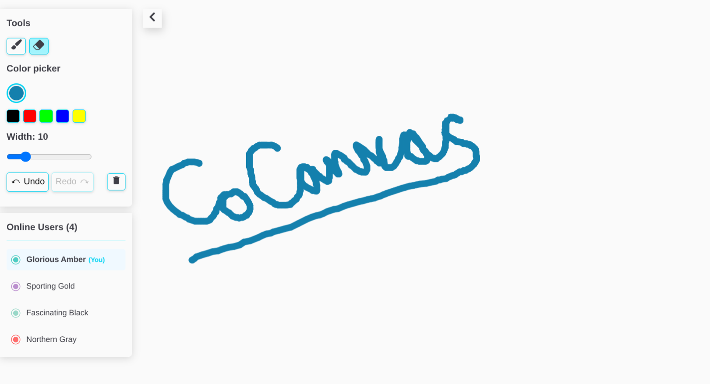

# CoCanvas - Collaborative Drawing Canvas

A real-time collaborative drawing application that allows multiple users to draw together on a shared canvas.

## ✨ Features

- 🎨 Freehand drawing (brush / eraser)
- 🌈 Color and brush size controls
- ⚡ Real-time drawing sync across multiple users
- 🖱️ Live cursor indicators for other users
- 👥 Active user list with automatic user color and user name assignment
- ↩️ Global Undo / Redo (shared across all users)

## 📸 Screenshots



## 🧰 Tech Stack

- **Frontend:** React + TypeScript + Canvas API
- **Backend:** Node.js + Socket.IO

## 🚀 Setup Instructions

```bash
npm install
npm start
```

The application will be available at `http://localhost:3000` (or the configured port).

## 🧪 Testing with Multiple Users

1. Open the application URL in multiple browser windows/tabs or devices
2. Each user will be assigned a unique color and a user name automatically
3. Start drawing in any window to see real-time synchronization across all instances
4. User cursors are visible to all connected participants

## ⚠️ Known Limitations & Bugs

- **No Authentication**: Anyone with the URL can join and draw
- **No Separate Rooms**: All users connect to a single shared canvas (no room/session isolation)
- **Global Undo/Redo**: Undo/Redo operations affect all users' drawings, not individual user actions
- **No Persistence**: Drawings are lost when all users disconnect
- **No Drawing History Export**: Cannot save or export the canvas as an image
- **Limited Drawing Tools**: Basic freehand drawing only (no shapes, text, or images)

## ⏱️ Time Spent on Project

**Total: ~22 hours**

- Basic setup and individual user drawing canvas: ~4 hours
- Multi-user connection, cursor tracking, and user management: ~7 hours
- Undo/redo logic implementation: ~5 hours
- Performance optimization and bug fixes: ~6 hours
